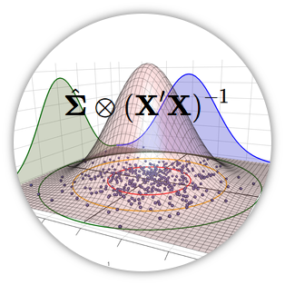

Multivariate Covariance Generalized Linear Models for the Analysis of Experimental Data
=======================================================================================

<a href="http://leg.ufpr.br/doku.php/pessoais:wbonat">Wagner Hugo Bonat</a> 
<code>wbonat at ufpr.br</code> 
Departamento de Estatística - UFPR

<a href="http://leg.ufpr.br/~walmes/">Walmes Marques Zeviani</a> 
<code>walmes at ufpr.br</code> 
Departamento de Estatística - UFPR

***

  * Short-cource at: [62nd RBras and 17th SEAGRO meeting](http://www.rbras.org.br/rbras62/)
  * Date: July 24th -- 28th, 2017
  * Local: Lavras-MG, Brazil
  * Workload: 4 hours

# Abstract

The design and analysis of experiments have a prominent role in science
and analysis of variance (ANOVA) methods have been the workhorse for
analysis of such data for decades.  Despite of the flexibility of the
ANOVA framework in terms of experimental design, in general the models
in this class deal only with a single independent Gaussian variable at
once. In many experiments more than one response is of interest for the
experimenter.  A natural extension of the ANOVA methods for multivariate
Gaussian data is the multivariate analysis of variance
(MANOVA). However, the extension of MANOVA methods for non-Gaussian data
is not thoroughly discussed in the literature.

The main goal of this course is to discuss the analysis of multivariate
experimental data based on the recently proposed multivariate covariance
generalized linear models (McGLM) framework (Bonat and Jørgensen;
2016)[^1].  This class of models can deal with multiple non-Gaussian
response variables and can easily be adapted to deal with the most
commons types of experimental designs, including multilevel and
longitudinal designs and correlated responses.  McGLMs can be seen as a
extension of the MANOVA approach for the analysis of non-Gaussian data.

We present the model specification along with strategies for model
fitting and the associated `R` code. Through study cases, we shall
discuss the benefits, drawbacks and cautions when using McGLMs.  The `R`
package `mcglm` (Bonat and Jørgensen; 2016) is presented and
supplementary material as `R` (R Core Team; 2015)[^2] code and data sets
will be made available for the students.

**Key-words**: multivariate response, generalized estimating equations,
Poisson-Tweedie, count data.

<!-- Links ---------------------------------- -->

[^1]: Bonat, W. H. and Jørgensen, B. (2016). Multivariate covariance
  generalized linear models, *Journal of the Royal Statistical Society:
  Series C (Applied Statistics)*. to appear.
[^2]: R Core Team (2015). *R: A Language and Environment for Statistical
  Computing*, R Foundation for Statistical Computing, Vienna,
  Austria. ISBN 3-900051-07-0.
[Wagner Hugo Bonat]: http://leg.ufpr.br/doku.php/pessoais:wbonat
[Walmes Marques Zeviani]: http://leg.ufpr.br/~walmes/
