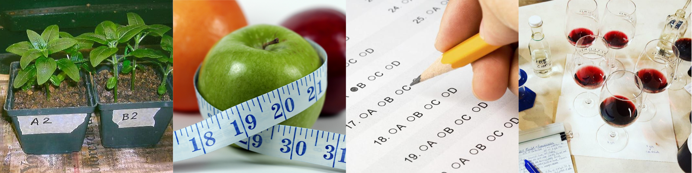
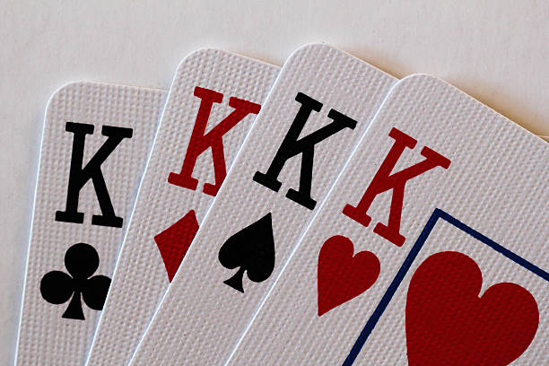

# The univariate analysis of experimental data

## Response variables in designed experiments

```{r, include = FALSE}
source("config/_setup.R")
options(show.signif.stars = FALSE)
```

  * Designed experiments usually record several response variables.
    - Size variables (weight, height, width, diameter, volume, etc).
    - Production variables (fresh/dry matter, yield, etc).
    - Resistance variables (to disease, to stress, etc).
    - Chemical variables (P, K, pH, Ca, Mg, etc).
    - Mechanical variables (firmness, colors, etc).
    - Sensory variables (sweetness, astringency, acidicity, etc).
    - Performance variables (scores in math, language, running,
      swimming, etc).
    - Aesthetic variables (colors, shapes, harmony, complexity, etc)
  * Sets of correlated variables for the same dimension (production,
    quality, leaning, flavor, etc).

```{r, echo = FALSE, out.width = "100%"}

```

## Analysing the responses individually

<!-- Code to show to commom situations. -->
```{r, include = FALSE}
#--------------------------------------------
data(soybeanwp, package = "wzRfun")

swp <- soybeanwp
names(swp) <- c("pts", "wtr", "blk",
                "yield", "w100", "Kconc", "tg", "nip", "nvp")
swp <- transform(swp,
                 Pts = factor(pts),
                 Wtr = factor(wtr))

#--------------------------------------------
# Condition 1: all the conclusions are quite the same.

# xyplot(yield + tg + w100 + Kconc ~ Wtr,
#        outer = TRUE, scales = "free",
#        data = subset(swp[-74, ], pts == 60))

form <- cbind(yield, tg, w100, Kconc) ~ blk + Wtr
m0 <- lm(form, data = subset(swp[-74, ], pts == 60))
summary.aov(m0)

library(doBy)
library(multcomp)

tb <- lapply(c("yield", "tg", "w100", "Kconc"),
             FUN = function(y) {
                 m0 <- lm(as.formula(sprintf("%s ~ blk + Wtr", y)),
                          data = subset(swp[-74, ], pts == 60))
                 m <- LSmeans(m0, effect = "Wtr")
                 g <- glht(model = m0, linfct = mcp(Wtr = "Tukey"))
                 g <- cld(g)$mcletters$Letters
                 r <- data.frame(Wtr = m$grid$Wtr,
                                 means = sprintf("%0.2f %s",
                                                 m$coef[, "estimate"],
                                                 g[as.character(m$grid$Wtr)]))
                 names(r)[2] <- y
                 return(r)
             })

# Table of means.
tbm <- Reduce(merge, x = tb)
tbm

#--------------------------------------------
# Condition 1: no sufficient evidence in each response.

# xyplot(yield + tg + w100 + Kconc ~ Wtr,
#        outer = TRUE, scales = "free",
#        data = subset(swp[-74, ], pts == 0))

m0 <- lm(form,
         data = subset(swp[-74, ], pts == 0))
summary.aov(m0)
```

Often, two situations occurs

  1. The results are pratically the same for all responses.
    ```{r, echo = FALSE, comment = NA, results = "hold"}
    cat(paste("Table of means followed by letters from a pairwise multiple comparisons",
              "test to a 3-level factor in a RBD.\n\n"))
    tbm
    ```
  2. There is not sufficient evidence in each response.
    ```{r, echo = FALSE, comment = NA, results = "hold"}
    cat(paste("ANOVA tables for 4 responses in a RBD.\n\n"))
    summary.aov(m0)
    ```

---

```{r, echo = FALSE, out.width = "75%"}
include_graphics("img/canonical_discriminant.png")
```

## Some questions

Its is difficult to know

  * Which is the best (set of) variable to measure?
  * Do the factors influence the response variables in the same way?

Probably, someone asked himself

  * Which variables are more influenced by the factors?
  * Which variables best indicate the effect of each factor?
  * Can a new variable be expressed in terms of the measured ones?
  * How this new variable summarizes all the results?

## Benefits and cautions

  * If the response variables are correlated, we should explore this
    source of information.
  * Multivariate models are more powerful to detect the effect of
    factors if the response variables are correlated.
  * A more useful or compact description of the results can be obtained.
  * Encourages a more global conclusion.
  * New insights and formulations can be done for future research.
  * BUT:
    - Its not obvious how to perform a multivariate analysis.
    - Its not obvious how to interpret their results.
    - There are less statistical methods available.
    - Most of them rely on the multivariate Gaussian distribution.

## Datasets

<!-- ### iris -->
<!--  -->
<!--   * The `iris` data set was collected by Anderson (1935) on three -->
<!--     species of irises in the Gaspé Peninsula of Quebec, Canada. -->
<!--   * 50 sample units for each of the 3 species. -->
<!--   * Responses: (sepal, petal) $\times$ (length, width). -->

### `soybean`: water and potassium in the plant production

  * Soybean (*Glicine max* L.) in greenhouse on a randomized block
    design.
  * 3 water content levels (irrigation) $\times$ 5 potassium levels
    (fertilization).
  * Responses: grain yield, weight of a hundred grains, number of
    grains, K concentration in the grain, number of (in)viable pods.
  * @Serafim2012.


### `cotton`: impact of defoliation and growth stage

  * Study the effect of defoliation levels at different growth stages of
    cotton in plant production.
  * Made in greenhouse in a complete randomized design.
  * Experimental unit: a plot with 2 cotton plants.
  * 5 growth stages $\times$ 5 defoliation levels.
  * Responses: number of bolls produced, total boll weight, plant height
    and number of plant nodes.
  * @Silva2012a.


### `wrc`: soil management in the water retention curve

  * Field experiment in a coffee plantation.
  * Responses: 4 parameters of the soil water retention curve (nonlinear
    model).
  * Repeated measures design.
  * 2 positions in the crop field (outer factor) $\times$ 5 soil layers
    (inner factor).
  * How soil management influence the water retention curve along soil
    layers?
  * @zeviani2013.

### `teak`: concentration of cations in the soil layers

  * 50 sampled sites on teak florest.
  * Several chemical soil variables measured in 3 soil layers for each
    site.
  * How is the concentration of cations in the soil layers?


## The next topics

  * A brief review of univariate models.
    * Emphasis on building linear hypothesis test.
  * The multivariate linear models.
  * The multivariate hypothesis tests.
  * Some additional topics.
  * Conclusion and remarks.

# The univariate linear model

## Model specification

The model for each observation $i = 1, \ldots, n$, is
$$
\begin{aligned}
  y_i &\sim \text{Normal}(\mu_i, \sigma^2)\\
  \mu_i &= \mathbf{X}_{i.}\boldsymbol{\beta},
\end{aligned}
$$

where

  * $y_i$: observed response for the $i$th sample unit.
  * $\mu_i$: its expected value (mean).
  * $\sigma^2$: the error variance (non explained variation).
  * $\mathbf{X}_{i.}$: ($1 \times k$) its row vector of (known)
    predictor variables.
  * $\boldsymbol{\beta}$: ($k \times 1$) the regression parameters
    associated to the predictor variables.

The model written for the response (column) vector is
$$
\begin{aligned}
  \mathbf{y} &=
    \mathbf{X}\boldsymbol{\beta} + \boldsymbol{\epsilon} \\
  \boldsymbol{\epsilon} &\sim
    \text{Normal}_n(\mathbf{0}, \sigma^2 \mathbf{I}) \Rightarrow
  \epsilon_i \overset{iid}{\sim}
    \text{Normal}(0, \sigma^2),
\end{aligned}
$$

where

  * $\mathbf{y}$: ($n \times 1$) (single) response variable.
  * $\mathbf{X}$: ($n \times k$) the complete design matrix.
  * $\boldsymbol{\beta}$: ($k \times 1$) already described.
  * $\boldsymbol{\epsilon}$: ($n \times 1$) error vector.
  * $\mathbf{I}$: ($n \times n$) an identity matrix.
  * $\epsilon_i$: $i$th element of the error vector.

## Likelihood function and estimation

The likelihood function for $\boldsymbol{\beta}$ and $\sigma^2$ is

$$
\begin{aligned}
L(\boldsymbol{\beta}, \sigma^2) &=
  \prod_{i=1}^n \left[
    (2\pi\sigma^2)^{-1/2}
      \exp\left\{-\frac{
        (y_i - \mathbf{X}_{i.}\boldsymbol{\beta})^2}{2\sigma^2}
      \right\}
  \right ]\\
  &=
  (2\pi\sigma^2)^{-n/2}
    \exp\left\{-\frac{
      (\mathbf{y} - \mathbf{X}\boldsymbol{\beta})'
      (\mathbf{y} - \mathbf{X}\boldsymbol{\beta})}{2\sigma^2}
    \right\}\\
  &=
  (2\pi)^{-n/2} |\sigma^2 \mathbf{I}|^{-1/2}
    \exp\left\{-\frac{1}{2}
      (\mathbf{y} - \mathbf{X}\boldsymbol{\beta})'
       (\sigma^2 \mathbf{I})^{-1}
      (\mathbf{y} - \mathbf{X}\boldsymbol{\beta})
    \right\}.
\end{aligned}
$$

The MLE estimators are

$$
\begin{aligned}
  \boldsymbol{\hat\beta} &=
    (\mathbf{X}' \mathbf{X})^{-1} \mathbf{X}' \mathbf{y}\\
  \hat{\sigma}^2 &=
    (\mathbf{y} - \mathbf{\hat y})'
    (\mathbf{y} - \mathbf{\hat y})/n,
      \quad \mathbf{\hat y} = \mathbf{X} \boldsymbol{\hat\beta},\\
\end{aligned}
$$

The maximized likelihood is

$$
\begin{aligned}
\max_{\beta, \sigma^2} L(\boldsymbol{\beta}, \sigma^2) &=
    L(\boldsymbol{\hat\beta}, \hat{\sigma}^2) \\
  &= (2\pi)^{-n/2} (\hat{\sigma}^2)^{-n/2}
       \exp\left\{-n/2 \right\}.
\end{aligned}
$$

## A simple example

The `soybean` dataset: 3 x 5 factorial experiment in a randomized block
design (RBD).  Analysing the yield of grains (`yield`). To make the
things simpler for now, we subset the data for the potassium level 0. So
the model corresponds to the one-way anova.

The model, in terms of the sources of variation or effects is
$$
  \text{mean}_{ij} = \text{intercept} + \text{BLK}_i + \text{WTR}_j
$$
where $i = 1, \ldots, 5;$ and $j = 1, 2, 3;$.

In greek letters notation
$$
  \mu_{ij} = \mu_0 + \gamma_i + \eta_j.
$$

## The $F$ test

The $F$ distribution plays a central role in hypotheses tests for
univariate Gaussian models.

It can be defined to be distribution of the ratio
$$
  \frac{\chi^2_{a}/a}{\chi^2_{b}/b} \sim F_{a;b}
$$
when $\chi^2_{a}$ and $\chi^2_{b}$ are independent.

A linear hypothesis can be expressed using different notations:

  * By the common ANOVA indexed notation
    $$
      H_0: \eta_j = 0 \text{ for all } j
      \quad \text{vs} \quad
      H_a: \eta_j \neq 0 \text{ for some } j.
    $$
  * By nested models:
    $$
      H_0: \mu_{ij} = \mu_0 + \gamma_i
        \quad \text{vs} \quad
      H_a: \mu_{ij} = \mu_0 + \gamma_i + \eta_j.
    $$
  * By a matrix of linear hypothesis $\mathbf{A}$:
    $$
      H_0: \mathbf{A}\boldsymbol{\beta} = \mathbf{c}
       \quad \text{vs} \quad
      H_a: \mathbf{A}\boldsymbol{\beta} \neq \mathbf{c}.
    $$

<!-- TODO Define the A matrix here! -->

## General linear hypothesis test

Linear hypothesis on $\boldsymbol{\beta}$ can be defined in terms of
matrices
$$
  H_0: \mathbf{A}\boldsymbol{\beta} = \mathbf{c}
    \quad \text{vs} \quad
  H_a: \mathbf{A}\boldsymbol{\beta} \neq \mathbf{c},
$$
where $\mathbf{A}$ is a known matrix of order $h \times k$ (rank $h \leq
k$) and $\mathbf{c}$ is a vector of $h$ elements.

For example, lets to construct the $\mathbf{A}$ to test the effect of
treatments (4 levels) in a randomized block design (3 blocks). The
expected mean for each $ij$ condition is

$$
  \mu_{ij} = \mu_0 + \gamma_i + \eta_j.
$$
where $i = 1, \ldots, 3;$ and $j = 1, \ldots, 4;$. To generate a full
rank design matrix, $\gamma_1$ and $\eta_1$ are set to zero.

The $H_0$ states that there is no effect of treatments and can be
expressed as

```{r, include = FALSE}
library(xtable)

printbmatrix <- function(x) {
    cat("\\begin{bmatrix}\n")
    print(xtable(x),
          include.rownames = FALSE,
          include.colnames = FALSE,
          only.contents = TRUE,
          hline.after = NULL,
          sanitize.text.function = identity,
          comment = FALSE)
    cat("\\end{bmatrix}\n")
}

A <- cbind(0, 0, 0, diag(3))
A[which(A == 1, arr.ind = TRUE)] <- "\\textcolor{red}{1}"

beta <- cbind(c("\\mu_0",
                sprintf("\\gamma_{%d}", 2:3),
                sprintf("\\textcolor{red}{\\eta_{%d}}", 2:4)))

c <- cbind(rep(0L, nrow(A)))
```
```{r, echo = FALSE, results = "asis"}
cat("$$\n")
printbmatrix(A)
printbmatrix(beta)
cat(" = ")
printbmatrix(c)
cat("\\quad \\Rightarrow \\quad")
printbmatrix(cbind(beta[grepl(x = beta, pattern = "eta")]))
cat(" = ")
printbmatrix(c)
cat(".")
cat("$$\n")
```

This hypothesis, in particular, can be tested by

  * the ANOVA table
  * the extra sum of squares approach (close connection with likelihood
ratio).
  * and the Wald test.

---

### Anova table

Consider the ANOVA table based on the reduction in the sum of squares
approach (sequential ANOVA).

Define as the sum of squares of the reduced model model
$$
  \text{RSS}_0 = \text{RSS} + \text{HSS}
$$
where $\text{HSS}$ is the treatment sum of squares, that is the sum of
squares of the term under the hypothesis $H_0$.

```{r, echo = FALSE, warning = FALSE}
tabaov <- data.frame(DF = sprintf("$%s$", c("l", "h", "n-k")),
                     stringsAsFactors = FALSE)
tabaov$SS <- sprintf("$%s$",
                     c("R(\\gamma|\\mu_0)",
                       "\\text{HSS} = R(\\eta|\\gamma,\\mu_0)",
                       "\\text{RSS}"))
tabaov$MS <- sprintf("$%s$",
                     c("\\phantom{0}",
                       "\\text{HSS}/h",
                       "\\text{RSS}/(n - k)"))
tabaov$F <- c("",
              "$\\frac{\\text{HSS}/h}{\\text{RSS}/(n - k)}$",
              "")
rownames(tabaov) <- c("Blocks", "Treatments", "Residuals")

output <- knitr::opts_knit$get("rmarkdown.pandoc.to")
l <- list(x = tabaov, align = "rccc")
if (output == "slidy") { l$format <- "html" }
if (output == "slidy") { l$table.attr <- "style=\"width: 100%;\"" }
do.call(kable, args = l)
```

$$
F = \frac{\text{HSS}}{\text{RSS}} \cdot \frac{n - k}{h} =
  \frac{\text{RSS}_0 - \text{RSS}}{\text{RSS}} \cdot \frac{n - k}{h}
  \sim F_{h; n - k}.
$$

Note that

---

### The likelihood ratio

<!-- @khuri2009linear -->

The maximized likelihood for a univariate LM is
$$
\begin{aligned}
\max_{\beta, \sigma^2} L(\boldsymbol{\beta}, \sigma^2) &=
    L(\boldsymbol{\hat\beta}, \hat{\sigma}^2) \\
  &= (2\pi)^{-n/2} (\hat{\sigma}^2)^{-n/2}
       \exp\left\{-n/2 \right\}.
\end{aligned}
$$

The likelihood ratio for two nested models is
$$
\begin{aligned}
\Lambda &= \frac{
  \max_{H_1} L(\textit{full model})}{
  \max_{H_0} L(\textit{reduced model})}\\
 &= \frac{
   L(\boldsymbol{\hat\beta}, \hat{\sigma}^2)}{
   L(\boldsymbol{\hat\beta}_0, \hat{\sigma}_0^2)}\\
 &= \left(\frac{\hat{\sigma}^2}{\hat{\sigma}_0^2} \right)^{-n/2}\\
 &= \left(\frac{n\hat{\sigma}^2 + n(\hat{\sigma}_0^2 - \hat{\sigma}^2)}{
      n\hat{\sigma}^2}\right)^{n/2}\\
 &\propto \frac{\text{RSS}_0 - \text{RSS}}{\text{RSS}}
\end{aligned}
$$

The deviance
$$
   n \log \left(\frac{\hat{\sigma}_0^2}{\hat{\sigma}^2} \right)
$$
approximates to $\chi^2_{k - q}$ under $H_0$.

It can be demonstrated that the quantities
$$
  \begin{aligned}
  \frac{n(\hat{\sigma}_0^2 - \hat{\sigma}^2)}{\sigma^2} &\sim \chi^2_{h}\\
  \frac{n\hat{\sigma}^2}{\sigma^2} &\sim \chi^2_{n - k}\\
  \end{aligned}
$$
are independent and
$$
F = \frac{n(\hat{\sigma}_0^2 - \hat{\sigma}^2)}{
  n\hat{\sigma}^2}\cdot \frac{n - k}{h} =
  \frac{\text{RSS}_0 - \text{RSS}}{\text{RSS}} \cdot \frac{n - k}{h}
  \sim F_{h;n - k}
$$

```{r, include = FALSE, eval = FALSE}
# The likelihood ratio follows a \chi^2 under H_0.
trt <- gl(5, 4)
n <- length(trt)
h <- nlevels(trt) - 1

# Simulation.
X2 <- replicate(1000, {
    y <- rnorm(n)
    m1 <- lm(y ~ trt)
    m0 <- update(m1, . ~ 1)
    s2_0 <- deviance(m0)/n
    s2_1 <- deviance(m1)/n
    X2 <- (n) * log(s2_0/s2_1)
    return(X2)
})

# Distribution of the p-values.
plot(ecdf(pchisq(X2, df = h)))
segments(0, 0, 1, 1, col = 2)
```

---

### Wald test

Under $H_0$,
$$
\frac{1}{\sigma^2}
  (\mathbf{A}\boldsymbol{\hat\beta}- \mathbf{c})'
  [\mathbf{A} (\mathbf{X}'\mathbf{X})^{-1} \mathbf{A}']^{-1}
  (\mathbf{A}\boldsymbol{\hat\beta}- \mathbf{c})
  \sim \chi^2_h.
$$
Follows that under $H_0$, the statistic
$$
\begin{aligned}
F &= \frac{(\mathbf{A}\boldsymbol{\hat\beta}- \mathbf{c})'
  [\mathbf{A} (\mathbf{X}'\mathbf{X})^{-1} \mathbf{A}']^{-1}
  (\mathbf{A}\boldsymbol{\hat\beta}- \mathbf{c})}{h\hat{\sigma}^2}\\
 &= \frac{(\mathbf{A}\boldsymbol{\hat\beta}- \mathbf{c})'
  [\mathbf{A} \hat{\Sigma}_{\beta} \mathbf{A}']^{-1}
  (\mathbf{A}\boldsymbol{\hat\beta}- \mathbf{c})}{h},\\
\end{aligned}
$$
has the $F$ distribution with $h$ and $n-k$ degress of freedom. The
matrix $\hat{\Sigma}_{\beta} = \hat{\sigma}^2
(\mathbf{X}'\mathbf{X})^{-1}$.

<!--
In fact, the expected mean squares in the ANOVA table are partitions of
the regression sum of squares and TODO.
-->

## Inferences in the univariate Gaussian linear model

  * Each $F$ statistic is centered in the ideia of how large is the
    $\text{HSS}$ (evidence against $H_0$) in relation to the
    $\text{RSS}$.
  * Anova is strategy based on least squares and sum of squares
    decomposition.
  * Likelihood is a full parametric model specification.
  * Wald test is an approxiamation for the likelihood ratio test.
  * It depends only on $\mathbf{\hat\beta}$ and $\mathbf{V}_\beta$.
  * They coincide only for the univariate Gaussian model.
  * Otherwise, they may not provide the same inferences.

# Multivariate Linear Models (MLM)

## Model specification

We are now extend the previous notation to consider a vector of $r$
responses measured in each sample unit.

The model for each sample unit $i = 1, \ldots, n$, is
$$
\begin{aligned}
  \mathbf{Y}_{i.} &\sim \text{Normal}_r(\boldsymbol{\mu}_i, \Sigma)\\
  \boldsymbol{\mu}_i &= \mathbf{X}_{i.}\boldsymbol{B},
\end{aligned}
$$

where

  * $\mathbf{Y}_{i.}$: ($1 \times r$) the observed response vector for
    the $i$th sample unit.
  * $\boldsymbol{\mu}_i$: its expected vector (mean).
  * $\Sigma$: the error covariance between responses (non explained
    variation).
  * $\mathbf{X}_{i.}$: ($1 \times k$) its row vector of (known)
    predictor variables.
  * $\boldsymbol{B}$: ($k \times r$) the regression parameters matrix
    associated to the predictor variables and responses.

The model written for the response matrix is
$$
\begin{aligned}
  \mathbf{Y} &=
    \mathbf{X}\boldsymbol{B} + \boldsymbol{E} \\
  \boldsymbol{E}_{i.} &\sim
    \text{Normal}_r(\mathbf{0}, \Sigma)
\end{aligned}
$$
where

  * $\mathbf{Y}$: ($n \times r$) the response matrix.
  * $\mathbf{X}$: ($n \times k$) the design matrix.
  * $\boldsymbol{B}$: ($k \times r$) already described.
  * $\boldsymbol{E}$: ($n \times r$) error matrix.
  * $\boldsymbol{E}_{i.}$: the $i$th row of the error matrix.

```{r, echo = FALSE, out.width = "90%"}
knitr::include_graphics("img/matricial_manova_2.png")
```

## Likelihood function

The likehood for one sample unit is
$$
\begin{aligned}
  L(\boldsymbol{B},\Sigma,\mathbf{Y}_{i.}) =
    (2\pi)^{-r/2} |\Sigma|^{-1/2}
    \exp\left\{
      -\frac{1}{2}
      (\mathbf{Y}_{i.} - \mathbf{X}_{i.}\boldsymbol{B})
       \Sigma^{-1}
      (\mathbf{Y}_{i.} - \mathbf{X}_{i.}\boldsymbol{B})'
    \right\}
\end{aligned}
$$

For all sample units is

$$
\begin{aligned}
  L(\boldsymbol{B},\Sigma,\mathbf{Y}) &= \prod_{i = 1}^n
    (2\pi)^{-r/2} |\Sigma|^{-1/2}
    \exp\left\{
      -\frac{1}{2}
      (\mathbf{Y}_{i.} - \mathbf{X}_{i.}\boldsymbol{B})
       \Sigma^{-1}
      (\mathbf{Y}_{i.} - \mathbf{X}_{i.}\boldsymbol{B})'
    \right\}\\
    &= (2\pi)^{-nr/2} |\Sigma|^{-n/2}
    \exp\left\{
      -\frac{1}{2} \sum_{i = 1}^n
      (\mathbf{Y}_{i.} - \mathbf{X}_{i.}\boldsymbol{B})
       \Sigma^{-1}
      (\mathbf{Y}_{i.} - \mathbf{X}_{i.}\boldsymbol{B})'
    \right\}.
\end{aligned}
$$

Using the vectorize ($\text{vec}$) operation and kronecker product
($\otimes$), the observed data can be reshaped from wide to long
format.

```{r, echo = FALSE, out.width = "90%"}
knitr::include_graphics("img/matricial_manova_reshape.png")
```

The same model is now represented by
$$
  \mathcal{Y} \sim
    \text{Normal}_{rn}(\mathcal{X}\boldsymbol{\beta}, \Omega),
$$
where $\Omega = \Sigma \otimes \mathbf{I}$.

```{r, echo = FALSE, out.width = "70%"}
# knitr::include_graphics("img/matricial_manova_Omega.png")
```

Also, it can be written as
$$
  \mathcal{Y} = \mathcal{X}\boldsymbol{\beta} + \mathcal{E}.
$$

In the stacked data format, the likelihood function is defined as
$$
L(\boldsymbol{\beta}, \Omega) =
  (2\pi)^{ -\frac{rn}{2} } |\Omega|^{-\frac{1}{2}}
  \exp \left\{
    -\frac{1}{2}
    (\mathcal{Y} - \mathcal{X}\boldsymbol{\beta})^{'}
    \Omega^{-1}
    (\mathcal{Y} - \mathcal{X}\boldsymbol{\beta})
  \right\}.
$$

The maximized likelihood is
$$
\begin{aligned}
L(\boldsymbol{\hat\beta}, \hat\Omega)
 &= (2\pi)^{-rn/2} |\hat\Sigma \otimes \mathbf{I}|^{-1/2}
  \exp \left\{
    -\frac{rn}{2}
  \right\}\\
 &= (2\pi)^{-rn/2} |\hat\Sigma|^{-n/2}
  \exp \left\{
    -\frac{rn}{2}
  \right\}.
\end{aligned}
$$

## Estimation and properties

$$
\begin{aligned}
{\boldsymbol{\hat B}} &=
  (\mathbf{X}'\mathbf{X})^{-1}\mathbf{X}'\mathbf{Y}\\
{\boldsymbol{\hat B}}_{.j} &=
  (\mathbf{X}'\mathbf{X})^{-1}\mathbf{X}'\mathbf{Y}_{.j}\\
{\boldsymbol{\hat \beta}} &=
  (\mathcal{X}'\mathcal{X})^{-1}\mathcal{X}'\mathcal{Y}\\
\text{Cov}({\boldsymbol{\hat\beta}}) &=
  {\hat\Sigma} \otimes
  (\mathbf{X}'\mathbf{X})^{-1}
  = \begin{bmatrix}
    \hat{\sigma}_{11}(\mathbf{X}'\mathbf{X})^{-1} &
    \cdots &
    \hat{\sigma}_{1r}(\mathbf{X}'\mathbf{X})^{-1} \\
    \vdots & \ddots & \vdots \\
    \hat{\sigma}_{r1}(\mathbf{X}'\mathbf{X})^{-1} &
    \cdots &
    \hat{\sigma}_{rr}(\mathbf{X}'\mathbf{X})^{-1}
    \end{bmatrix}
\end{aligned}
$$

## Hypotheses tests on $\boldsymbol{B}$ or $\boldsymbol{\beta}$

A linear hypothesis can be defined in two equivalent ways.

$$
H_0: \mathbf{A}\boldsymbol{B}\mathbf{M} = \mathbf{C}
  \quad \textrm{vs} \quad
H_1: \mathbf{A}\boldsymbol{B}\mathbf{M} \neq \mathbf{C}
$$

where

  * $\mathbf{A}$ is a $h \times k$ ($h = \text{rank}(\mathbf{A}) < k$)
    matrix.
  * $\boldsymbol{B}$ is the $k \times r$ parameter matrix.
  * $\mathbf{M}$ is a $r \times v$ ($v \leq r$) matrix of linear
    hypothesis on the responses. The most common scenario is when
    $\boldsymbol{M} = \boldsymbol{I}_r$.
  * $\mathbf{C}$ is a $h \times v$ matrix.

Example of $\mathbf{A}\boldsymbol{B}\mathbf{M} = \mathbf{C}$ to test
$H_0: \eta_{mj} = 0$ for all $mj$, $m = 1, 2; j = 2, \ldots, 4$. These
matrices are

```{r, include = FALSE}
A <- cbind(0, 0, 0, diag(3))
A[which(A == 1, arr.ind = TRUE)] <- "\\textcolor{red}{1}"

i <- c(0, 2:3, 2:4)
r <- 1:2
index <- expand.grid(i = i,
                     r = r,
                     KEEP.OUT.ATTRS = FALSE)
beta <- rep(c("\\mu_{%d%d}",
              "\\gamma_{%d%d}",
              "\\textcolor{red}{\\eta_{%d%d}}"),
            times = c(1, 2, 3))
beta <- sprintf(beta, index[, 2], index[, 1])
beta <- matrix(beta, length(i), length(r))

M <- diag(rep(1L, ncol(beta)))
C <- matrix(0L, nrow(A), ncol(beta))
```
```{r, echo = FALSE, results = "asis"}
cat("$$\n")
cat("\\begin{aligned}\n")
printbmatrix(A)
printbmatrix(beta)
printbmatrix(M)
cat(" &= ")
printbmatrix(C)
cat("\\\\")
cat("\\Rightarrow")
printbmatrix(cbind(beta[grepl(x = beta[, 1], pattern = "eta"), ]))
cat(" &= ")
printbmatrix(C)
cat(".")
cat("\\end{aligned}\n")
cat("$$\n")
```

The same linear hypothesis can be represented in using the vectorized
form of $\boldsymbol{B}$, $\boldsymbol{\beta}$

$$
H_0: \mathbf{L}\boldsymbol{\beta} = \mathbf{c}
  \quad \textrm{vs} \quad
H_1: \mathbf{L}\boldsymbol{\beta} \neq \mathbf{c}
$$

where

  * $\mathbf{L} = \mathbf{M}' \otimes \mathbf{A}$ is a $rh \times vk$
    matrix.
  * $\boldsymbol{\beta}$ is the $rk \times 1$ parameter vector.
  * $\mathbf{c}$ is a $rv \times 1$ vector.

```{r, echo = FALSE, results = "asis", comment = NA}
A <- cbind(0, 0, 0, diag(3))
L <- kronecker(t(M), A)
L[which(L == 1, arr.ind = TRUE)] <- "\\textcolor{red}{1}"
beta <- cbind(c(beta))
cat("$$\n")
# cat("\\begin{aligned}\n")
printbmatrix(L)
printbmatrix(beta)
cat(" = ")
printbmatrix(cbind(c(C)))
cat(".")
# cat("\\end{aligned}\n")
cat("$$\n")
```

---

Let $\mathbf{R}$ be the residual sum of squares and cross products
(SSP) of the full model
$$
  \mathbf{R} = (\mathbf{Y} - \mathbf{X}\boldsymbol{\hat{B}})'
    (\mathbf{Y} - \mathbf{X}\boldsymbol{\hat{B}}).
$$

Defines $\mathbf{H}$ as the hypothesis SSP matrix,
$$
\begin{aligned}
  \mathbf{H}
      &= n(\hat{\Sigma}_0 - \hat{\Sigma})\\
      &= (\mathbf{A}\boldsymbol{\hat{B}}\mathbf{M} - \mathbf{C})'
    [\mathbf{A} (\mathbf{X}'\mathbf{X})^{-1} \mathbf{A}']^{-1}
         (\mathbf{A}\boldsymbol{\hat{B}}\mathbf{M} - \mathbf{C}),
\end{aligned}
$$

The statistic
$$
  \text{tr} (\mathbf{H}\mathbf{R}^{-1}) = \sum_{i = 1}^{s} \lambda_i
$$
is known as *Hotteling-Lawley trace*. The values $\lambda_1 \geq
\lambda_2 \geq \ldots \lambda_s$ are the nonzero eigen values of
$\mathbf{H}\mathbf{R}^{-1}$.

@Berndt1977 show that the same value is obtained as the result of a Wald
test using the vectorized version of the components

$$
\text{tr} (\mathbf{H}\mathbf{R}^{-1}) =
(\mathbf{L} \boldsymbol{\hat\beta} - \mathbf{c})'
  [\mathbf{L} (
    (\mathbf{M}' \mathbf{R} \mathbf{M}) \otimes
    (\mathbf{X}'\mathbf{X})^{-1})
   \mathbf{L}']^{-1}
  (\mathbf{L} \boldsymbol{\hat\beta} - \mathbf{c}).
$$

Under $H_0$, the statistic
$$
  n \text{tr} (\mathbf{H}\mathbf{R}^{-1}),
$$
has a limiting $\chi^2$ distribution with $vh$ degrees of freedom.

---

A test based on the likelihood ratio is written in terms of generalized
variances
$$
\begin{aligned}
  \Lambda
   &= \frac{\max_{H_0} L(\beta, \Sigma)}{\max L(\beta, \Sigma)} \\
   &= \left(\frac{|\hat{\Sigma}_0|}{|\hat{\Sigma}|}\right)^{-n/2},\\
\end{aligned}
$$
and the *Wilks' statistic* is
$$
  \Lambda^{2/n} = \frac{|\hat{\Sigma}|}{|\hat{\Sigma}_0|}.
$$

Under $H_0$, $n\hat{\Sigma} \sim W_{r;n-k}$ independently
of $n(\hat{\Sigma}_0 - \hat{\Sigma}) \sim W_{r;h}$. The likelihood ratio
test of $H_0$ is equivalent to reject $H_0$ for large values of the
deviance
$$
  -2 \log \Lambda =
    -n \log
      \left(
      \frac{|n\hat{\Sigma}|}{
        |n\hat{\Sigma} + n(\hat{\Sigma}_0 - \hat{\Sigma})|}
      \right).
$$

Under $H_0$, the above statistic has a limiting $\chi^2$ distribution
with $vh$ degrees of freedom.

## The four multivariate hypothesis tests

For the same hypothesis, there are four multivariate tests.

$$
\begin{aligned}
\text{Wilk's lambda}
  &= \frac{|\mathbf{R}|}{|\mathbf{R} + \mathbf{H}|}
   = \prod_{i=1}^s \frac{1}{1+\lambda_i}\\
\text{Hotelling-Lawley trace}
  &= \text{tr}(\mathbf{H}\mathbf{R}^{-1})
   = \sum_{i=1}^s \lambda_i\\
\text{Pillai's trace}
  &= \text{tr}(\mathbf{H}(\mathbf{H} + \mathbf{R})^{-1})
   = \sum_{i=1}^s \frac{\lambda_i}{1+\lambda_i}\\
\text{Roy's greatest root}
  &= \max(\lambda_1,\ldots,\lambda_s) = \lambda_1
\end{aligned}
$$

```{r, echo = FALSE, out.width = "60%"}

```

We did a small simulation study to access the limiting $\chi^2$ and $F$
approximation for each of this tests.

---

## Recomendations

```{r, echo = FALSE, out.width = "75%"}
knitr::include_graphics("img/rencher-fig6-2.jpg")
```

  * They differ in the way they measure the evidence against the null
    hypothesis.
  * The multivariate space offers many perspectives.
  * Some general recomendations are:
    * Roy's largest root is the most powerful if one linear function
      of the variables can resume the results well.
    * Pillai's trace is the most used because it is more robust to
      departures from the assumptions.
    * Wilks is appealing because it is a LRT.
    * Hotteling-Lawley is a generalization of the $T^2$ statistic and
      can be directlty applied for non Gaussian contexts.

## Canonical discriminant analysis.

  * Related to canonical correlation and principal components.
  * Based on eigen values decomposition.
  * A very interesting complement for multivariate analysis.
  * Finds linear combinations of the responses variables that maximizes
    the effect of preditors.

```{r, echo = FALSE, out.width = "75%"}
include_graphics("img/canonical_discriminant.png")
```

## Examples

## Additional topics

  * Assumptions: all depends on the Holy Trinity of Normality,
    Homoscedasticity and Independence.
  * Diagnostics: there are some visual and hypothesis based approaches
    to diagnostic departures from the Holy Trinity.
  * Beyond the scope of this course.
  * Limitations:
    * Missigns in some responses for a sample unit implies in deletion
      of the entire sample unit.
  * Extensions:
    * Multiple design MLM (responses with different sets of predictors).
    * Predictors with random effects (random/mixed MLM).
    * Correlations between sample units (split-plot design).
    * Non-gaussian responses.
    * and more.

# References

---

```{r, echo = FALSE, results = "asis", message = FALSE, warning = FALSE, error = FALSE}
if (knitr::opts_knit$get("rmarkdown.pandoc.to") == "slidy") {
    cat('<!-- Insert the refereces right here! -->',
        '<div id="refs">',
        '</div>\n',
        sep = "\n")
}
```
