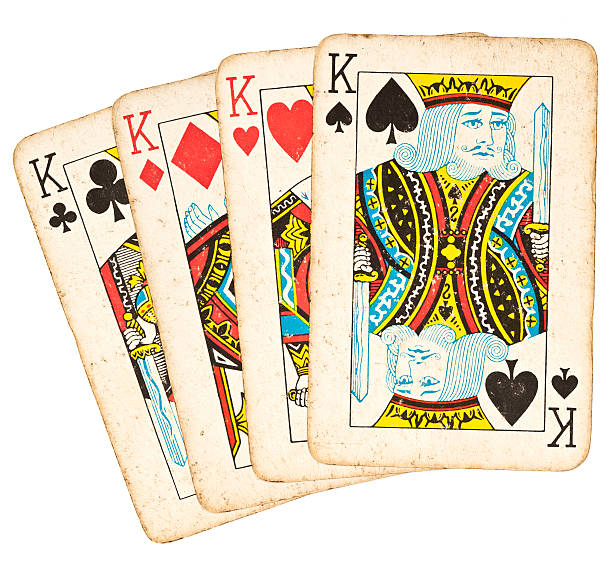
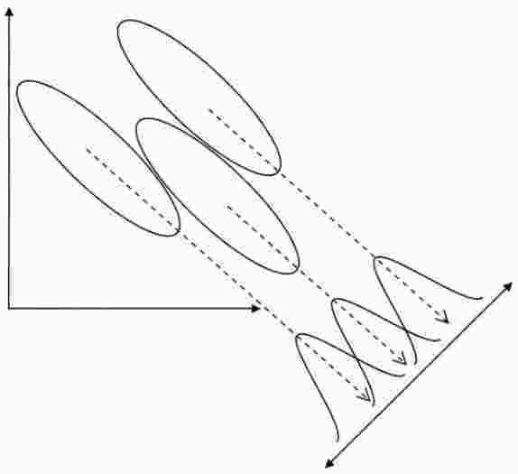

# A quick overview of Linear Models (LM)

## Model specification

The model for each observation $i = 1, \ldots, n$, is
$$
\begin{aligned}
  y_i &\sim \text{Normal}(\mu_i, \sigma^2)\\
  \mu_i &= \mathbf{X}_{i.}\boldsymbol{\beta},
\end{aligned}
$$

where

  * $y_i$: observed response for the $i$th sample unit.
  * $\mu_i$: its expected value (mean).
  * $\sigma^2$: the error variance (non explained variation).
  * $\mathbf{X}_{i.}$: ($1 \times k$) its row vector of (known) predictor
    variables.
  * $\boldsymbol{\beta}$: ($k \times 1$) the regression parameters
    associated to the predictor variables.

The model written for the response (column) vector is
$$
\begin{aligned}
  \mathbf{y} &=
    \mathbf{X}\boldsymbol{\beta} + \boldsymbol{\epsilon} \\
  \boldsymbol{\epsilon} &\sim
    \text{Normal}_n(\mathbf{0}, \sigma^2 \mathbf{I}) \Rightarrow
  \epsilon_i \overset{iid}{\sim}
    \text{Normal}(0, \sigma^2),
\end{aligned}
$$

where

  * $\mathbf{y}$: ($n \times 1$) (single) response variable.
  * $\mathbf{X}$: ($n \times k$) the complete design matrix.
  * $\boldsymbol{\beta}$: ($k \times 1$) already described.
  * $\boldsymbol{\epsilon}$: ($n \times 1$) error vector.
  * $\mathbf{I}$: ($n \times n$) an identity matrix.
  * $\epsilon_i$: $i$th element of the error vector.

## Likelihood function and estimation

The likelihood function for $\boldsymbol{\beta}$ and $\sigma^2$ is

$$
\begin{aligned}
L(\boldsymbol{\beta}, \sigma^2) &=
  \prod_{i=1}^n \left[
    (2\pi\sigma^2)^{-1/2}
      \exp\left\{-\frac{
        (y_i - \mathbf{X}_{i.}\boldsymbol{\beta})^2}{2\sigma^2}
      \right\}
  \right ]\\
  &=
  (2\pi\sigma^2)^{-n/2}
    \exp\left\{-\frac{
      (\mathbf{y} - \mathbf{X}\boldsymbol{\beta})'
      (\mathbf{y} - \mathbf{X}\boldsymbol{\beta})}{2\sigma^2}
    \right\}\\
  &=
  (2\pi)^{-n/2} |\sigma^2 \mathbf{I}|^{-1/2}
    \exp\left\{-\frac{1}{2}
      (\mathbf{y} - \mathbf{X}\boldsymbol{\beta})'
       (\sigma^2 \mathbf{I})^{-1}
      (\mathbf{y} - \mathbf{X}\boldsymbol{\beta})
    \right\}.
\end{aligned}
$$

The MLE estimators are

$$
\begin{aligned}
  \boldsymbol{\hat\beta} &=
    (\mathbf{X}' \mathbf{X})^{-1} \mathbf{X}' \mathbf{y}\\
  \hat{\sigma}^2 &=
    (\mathbf{y} - \mathbf{\hat y})'
    (\mathbf{y} - \mathbf{\hat y})/n,
      \quad \mathbf{\hat y} = \mathbf{X} \boldsymbol{\hat\beta},\\
\end{aligned}
$$

The maximized likelihood is

$$
\begin{aligned}
\max_{\beta, \sigma^2} L(\boldsymbol{\beta}, \sigma^2) &=
    L(\boldsymbol{\hat\beta}, \hat{\sigma}^2) \\
  &= (2\pi)^{-n/2} (\hat{\sigma}^2)^{-n/2}
       \exp\left\{-n/2 \right\}.
\end{aligned}
$$

## Linear hypotheses tests on $\boldsymbol{\beta}$

A linear hypothesis is
$$
H_0: \mathbf{F}\boldsymbol{\beta} = \mathbf{c}
  \quad \textrm{vs} \quad
H_1: \mathbf{F}\boldsymbol{\beta} \neq \mathbf{c}
$$

where

  * $\mathbf{F}$ is a $h \times k$ ($h = \text{rank}(\mathbf{F}) < k$)
    matrix.
  * $\mathbf{c}$ is a $h \times 1$ vector.

There are two especial cases of this formulation:

  * When $\mathbf{F}$ is used to test the effect of some predictor
    variables. For example
    $$
    \begin{align*}
      \mu_{ij} &= \mu + \tau_i + \lambda_j,\quad i = 2, 3, 4;\quad j=2, 3.\\
      H_0 &: \tau_2 = 0 \cap \tau_3 = 0 \cap \tau_4 = 0
        \Rightarrow \tau_i = 0, \forall i.\\
    \end{align*}
    $$
    In terms fo the above formulation, this is
    $$
    \begin{bmatrix}
      0 & 1 & 0 & 0 & 0 & 0\\
      0 & 0 & 1 & 0 & 0 & 0\\
      0 & 0 & 0 & 1 & 0 & 0
    \end{bmatrix}
    \begin{bmatrix}
      \mu \\
      \tau_2 \\
      \tau_3 \\
      \tau_4 \\
      \lambda_2\\
      \lambda_3
    \end{bmatrix} =
    \begin{bmatrix}
      0\\ 0\\ 0
    \end{bmatrix}.
    $$
    This can be tested comparing nested models
    $$
    \begin{align*}
      \mu_{ij} &= \mu + \tau_i + \lambda_j \quad \text{(full model)}\\
               & \text{vs}\\
      \mu_{ij} &= \mu + \lambda_j \quad \text{(reduced model)}
    \end{align*}
    $$
  * When $\mathbf{F}$ describes contrasts. For example
    $$
    H_0 : \mu_{.2} - \mu_{.3} = 0
      \quad \Rightarrow \quad
      \lambda_2 - \lambda_3 = 0.
    $$
    This is written as
    $$
    \begin{bmatrix}
      0 & 0 & 0 & 0 & 1 & -1
    \end{bmatrix}
    \begin{bmatrix}
      \mu \\
      \tau_2 \\
      \tau_3 \\
      \tau_4 \\
      \lambda_2\\
      \lambda_3
    \end{bmatrix} =
    \begin{bmatrix}
      0
    \end{bmatrix}.
    $$
    The above hypothesis can be tested through nested models if you
    recode the factor levels combining levels 2 and 3 into a single one.

## Likelihood ratio test

Let $\boldsymbol{\hat\beta}_0$ and $\sigma^2_0$ the MLE under the
$H_0$.

The likelihood ratio test is the ratio of the maximized likelihoods.
$$
\begin{align*}
\Lambda &= \frac{
  \max_{H_0} L(\textit{reduced model})}{
  \max_{H_1} L(\textit{full model})}\\
 &= \frac{
  \max_{\beta_0, \sigma_0^2} L(\boldsymbol{\beta}_0, \sigma_0^2)}{
  \max_{\beta, \sigma^2} L(\boldsymbol{\beta}, \sigma^2)}\\
 &= \frac{L(\boldsymbol{\hat\beta}_0, \hat{\sigma}_0^2)}{
  L(\boldsymbol{\hat\beta}, \hat{\sigma}^2)}\\
 &= \left(\frac{\hat{\sigma}_0^2}{\hat{\sigma}^2} \right)^{-n/2}
\end{align*}
$$

Notice the kernel of this test is a ratio of variances.

In terms of deviance, we get
$$
\begin{align*}
  D &= 2 \log\left(\frac{\max L}{\max_{H_0} L} \right)\\
    &= 2 \log \left[\left(
      \frac{\hat{\sigma}^2}{\hat{\sigma}_0^2}\right)^{-n/2} \right]\\
    &= -n \log \left(
      \frac{\hat{\sigma}^2}{\hat{\sigma}_0^2}\right)\\
  &= -n \log\left(
    \frac{\text{RSS}}{\text{RSS}_0} \right),\\
\end{align*}
$$
where $\text{RSS} = n\hat{\sigma}^2$ and $\text{RSS}_0 = n
\hat{\sigma}_0^2$.

Under $H_0$, $D$ has an asymptotic $\chi^2$ distribution with $h$
degrees of freedom.

```{r, eval = FALSE, include = FALSE}
# Chi-square distribution of the deviance.
trt <- gl(4, 25)
h <- nlevels(trt) - 1
n <- length(trt)
pval <- replicate(2000, {
    y <- rnorm(n)
    m1 <- lm(y ~ trt)
    m0 <- update(m1, y ~ 1)
    X2 <- -n * log(deviance(m1)/deviance(m0))
    pchisq(X2, df = h)
})
plot(ecdf(pval))
segments(0, 0, 1, 1, col = 2)
```

Remember that $\text{RSS}_0 = \text{RSS} + \text{ExtraSS}$. The
$\text{ExtraSS}$ is due the constrain in the hypothesis $H_0$, so it
will be named hypothesis sum of squares
$$
\text{HSS} = \text{RSS}_0 - \text{RSS}.
$$

Remember that the $F$ test in the ANOVA is a ratio of mean squares
($\text{MS}$),
$$
  F = \frac{\text{HMS}}{\text{RMS}} =
    \frac{\text{HSS}/h}{\text{RSS}/(n - k)} \sim F_{h;n-k}.
$$

The above can be rewritten using the $\text{HSS}$. The kernel of the
$\Lambda$ statistic is $\frac{\hat{\sigma}_0^2}{\hat{\sigma}^2}$.

That is practically the same what is been doing in the likelihood,
$$
  \frac{\hat{\sigma}_0^2}{\hat{\sigma}^2} =
  1 + \frac{\hat{\sigma}_0^2 - \hat{\sigma}^2}{\hat{\sigma}^2}
  \propto \frac{n(\hat{\sigma}_0^2 - \hat{\sigma}^2)}{n\hat{\sigma}^2} =
  \frac{\text{RSS}_0 - \text{RSS}}{\text{RSS}}
  \propto \frac{\text{HSS}}{\text{RSS}}\cdot\frac{n-k}{h}
  \sim F_{h;n-k}.
$$

## Wald test

The Wald test can test the same hypothesis based on the extra sum of
squares, $\text{HSS}$,
$$
\begin{align*}
H_0\, &: \mathbf{F}\boldsymbol{\beta} = \mathbf{c}\\
\text{HSS} &=
   (\mathbf{F} \boldsymbol{\hat\beta} - \mathbf{c})'
   [\mathbf{F} (\mathbf{X}'\mathbf{X})^{-1}\mathbf{F}']^{-1}
   (\mathbf{F}\boldsymbol{\hat\beta} - \mathbf{c})\\
\end{align*}
$$
where $\text{HSS}$ is the extra sum of squares due the hypothesis $H_0$.

Under the $H_0$, the statistic
$$
\begin{align*}
F &= \frac{\text{HSS}}{h\hat{\sigma}^2} \\
  &= \frac{\text{HSS}}{\text{RSS}}\cdot\frac{n-k}{h} \sim F_{h; n - k},
\end{align*}
$$
has an $F$ distribution with $h$ and $n - k$ degrees of freedom.

The Wald test can be written in terms of the covariânce matrix of
$\boldsymbol{\hat\beta}$, $\hat{\Sigma}_{\beta}$,
$$
F =
   (\mathbf{F} \boldsymbol{\hat\beta} - \mathbf{c})'
   [\mathbf{F} (\hat{\Sigma}_{\beta})\mathbf{F}']^{-1}
   (\mathbf{F}\boldsymbol{\hat\beta} - \mathbf{c}),
$$
where $\hat{\Sigma}_{\beta} =
\hat{\sigma}^2 (\mathbf{X}'\mathbf{X})^{-1}$.

## Key facts

Fifty shades of the $F$ statistic

  * Likelihood ratio test (ratio of variances)
  * Sum of squares decomposition (ratio of mean squares)
  * Mahalanobis distance (Wald)

The $F$ statistic from the likelihood ratio test, ANOVA or Wald is the
same.

Each $F$ device is centered in the ideia of how large is the
$\text{HSS}$ (evidence against $H_0$) in relation to the $\text{RSS}$.

# Multivariate Linear Models (MLM)

## Model specification

We are now extend the previous notation to consider a vector of $r$
responses measured in each sample unit.

The model for each sample unit $i = 1, \ldots, n$, is
$$
\begin{aligned}
  \mathbf{Y}_{i.} &\sim \text{Normal}_r(\boldsymbol{\mu}_i, \Sigma)\\
  \boldsymbol{\mu}_i &= \mathbf{X}_{i.}\boldsymbol{B},
\end{aligned}
$$

where

  * $\mathbf{Y}_{i.}$: ($1 \times r$) the observed response vector for
    the $i$th sample unit.
  * $\boldsymbol{\mu}_i$: its expected vector (mean).
  * $\Sigma$: the error covariance between responses (non explained
    variation).
  * $\mathbf{X}_{i.}$: ($1 \times k$) its row vector of (known)
    predictor variables.
  * $\boldsymbol{B}$: ($k \times r$) the regression parameters matrix
    associated to the predictor variables and responses.

The model written for the response matrix is
$$
\begin{aligned}
  \mathbf{Y} &=
    \mathbf{X}\boldsymbol{B} + \boldsymbol{E} \\
  \boldsymbol{E}_{i.} &\sim
    \text{Normal}_r(\mathbf{0}, \Sigma)
\end{aligned}
$$
where

  * $\mathbf{Y}$: ($n \times r$) the response matrix.
  * $\mathbf{X}$: ($n \times k$) the design matrix.
  * $\boldsymbol{B}$: ($k \times r$) already described.
  * $\boldsymbol{E}$: ($n \times r$) error matrix.
  * $\boldsymbol{E}_{i.}$: the $i$th row of the error matrix.

```{r, echo = FALSE, out.width = "90%"}
knitr::include_graphics("../slides/img/matricial_manova_2.png")
```

## Likelihood function

The likehood for one sample unit is
$$
\begin{aligned}
  L(\boldsymbol{B},\Sigma,\mathbf{Y}_{i.}) =
    (2\pi)^{-r/2} |\Sigma|^{-1/2}
    \exp\left\{
      -\frac{1}{2}
      (\mathbf{Y}_{i.} - \mathbf{X}_{i.}\boldsymbol{B})
       \Sigma^{-1}
      (\mathbf{Y}_{i.} - \mathbf{X}_{i.}\boldsymbol{B})'
    \right\}
\end{aligned}
$$

For all sample units is

$$
\begin{aligned}
  L(\boldsymbol{B},\Sigma,\mathbf{Y}) &= \prod_{i = 1}^n
    (2\pi)^{-r/2} |\Sigma|^{-1/2}
    \exp\left\{
      -\frac{1}{2}
      (\mathbf{Y}_{i.} - \mathbf{X}_{i.}\boldsymbol{B})
       \Sigma^{-1}
      (\mathbf{Y}_{i.} - \mathbf{X}_{i.}\boldsymbol{B})'
    \right\}\\
    &= (2\pi)^{-nr/2} |\Sigma|^{-n/2}
    \exp\left\{
      -\frac{1}{2} \sum_{i = 1}^n
      (\mathbf{Y}_{i.} - \mathbf{X}_{i.}\boldsymbol{B})
       \Sigma^{-1}
      (\mathbf{Y}_{i.} - \mathbf{X}_{i.}\boldsymbol{B})'
    \right\}.
\end{aligned}
$$

Its id convenient to use the stacked version of the matrices.

  * Define the $\text{vec}$ as the operator that stacks the columns of a
    $n \times r$ matrix creating a $rn \times 1$ vector
    $$
    \mathbf{Y} = \begin{bmatrix}
      y_{11} & y_{12}\\
      y_{21} & y_{22}\\
      y_{31} & y_{32}
    \end{bmatrix}
    \quad  \text{ then } \quad
    \text{vec}(\mathbf{Y})  =
    \begin{bmatrix}
      y_{11}\\ y_{21}\\ y_{31}\\ \vdots \\ y_{32}
    \end{bmatrix}.
    $$
  * Define the $\text{Bdiag}$ as the operator that return the direct sum
    of a set of matrices
    $$
    \begin{align*}
    \text{Bdiag}(\mathbf{X}_1, \mathbf{X}_2,
      \ldots, \mathbf{X}_r) &=
    {\mathbf{X}_1} \oplus {\mathbf{X}_2} \oplus
      \cdots \oplus {\mathbf{X}_r} = \bigoplus_{j=1}^r \mathbf{X}_j \\
    &=
    {\begin{bmatrix}
     {\mathbf{X}_1}   & {\boldsymbol{0}} & \cdots & {\boldsymbol{0}}\\
     {\boldsymbol{0}} & {\mathbf{X}_2}   & \cdots & {\boldsymbol{0}}\\
      \vdots          &  \vdots          & \ddots &  \vdots\\
     {\boldsymbol{0}} & {\boldsymbol{0}} & \cdots & {\mathbf{X}_r}\\
    \end{bmatrix}}.
    \end{align*}
    $$
  * Define as the Kroneker product of two matrices the operation
    $$
    \mathbf{A} \otimes \mathbf{B} =
      \begin{bmatrix}
        a_{11} \mathbf{B} & \cdots & a_{1n} \mathbf{B} \\
                   \vdots & \ddots & \vdots \\
        a_{m1} \mathbf{B} & \cdots & a_{mn} \mathbf{B}
      \end{bmatrix}.
    $$

Using these operators, the components for the stacked representation are

  * $\mathcal{Y} = \text{vec}(\mathbf{Y})$ is the $rn \times 1$
    response vector.
  * $\mathcal{X} = \text{Bdiag}(\mathbf{X}_1, \ldots, \mathbf{X}_r)$
    is the $rn \times rk$ design matrix for the stacked response
    vector.
  * $\boldsymbol{\beta} = \text{vec}(\boldsymbol{B})$ is the $rk
    \times 1$ parameter vector.
  * $\Omega = \Sigma \otimes \mathbf{I}_n$ is the covariance between
    elements in the response vector.

The model is now represented by

$$
  \mathcal{Y} \sim
    \text{Normal}_{rn}(\mathcal{X}\boldsymbol{\beta}, \Omega).
$$

Also, it can be written as
$$
  \mathcal{Y} = \mathcal{X}\boldsymbol{\beta} + \mathcal{E}
$$

```{r, echo = FALSE, out.width = "75%"}
knitr::include_graphics("../slides/img/matricial_manova_3.png")
```

The likelihood function is then defined as

$$
L(\boldsymbol{\beta}, \Omega) =
  (2\pi)^{ -\frac{rn}{2} } |\Omega|^{-\frac{1}{2}}
  \exp \left\{
    -\frac{1}{2}
    (\mathcal{Y} - \mathcal{X}\boldsymbol{\beta})^{'}
    \Omega^{-1}
    (\mathcal{Y} - \mathcal{X}\boldsymbol{\beta})
  \right\}.
$$

The maximized likelihood is

$$
\begin{align*}
L(\boldsymbol{\hat\beta}, \hat\Omega)
 &= (2\pi)^{-rn/2} |\hat\Sigma \otimes \mathbf{I}|^{-1/2}
  \exp \left\{
    -\frac{rn}{2}
  \right\}\\
 &= (2\pi)^{-rn/2} |\hat\Sigma|^{-n/2}
  \exp \left\{
    -\frac{rn}{2}
  \right\}.
\end{align*}
$$

## Estimation and properties

$$
\begin{align*}
{\boldsymbol{\hat B}} &=
  (\mathbf{X}'\mathbf{X})^{-1}\mathbf{X}'\mathbf{Y}\\
{\boldsymbol{\hat B}}_{.j} &=
  (\mathbf{X}'\mathbf{X})^{-1}\mathbf{X}'\mathbf{Y}_{.j}\\
{\boldsymbol{\hat \beta}} &=
  (\mathcal{X}'\mathcal{X})^{-1}\mathcal{X}'\mathcal{Y}\\
\text{Cov}({\boldsymbol{\hat\beta}}) &=
  {\hat\Sigma} \otimes
  (\mathbf{X}'\mathbf{X})^{-1}
  = \begin{bmatrix}
    \hat{\sigma}_{11}(\mathbf{X}'\mathbf{X})^{-1} &
    \cdots &
    \hat{\sigma}_{1r}(\mathbf{X}'\mathbf{X})^{-1} \\
    \vdots & \ddots & \vdots \\
    \hat{\sigma}_{r1}(\mathbf{X}'\mathbf{X})^{-1} &
    \cdots &
    \hat{\sigma}_{rr}(\mathbf{X}'\mathbf{X})^{-1}
    \end{bmatrix}
\end{align*}
$$

## Hypotheses tests on $\boldsymbol{B}$ or $\boldsymbol{\beta}$

A linear hypothesis can be defined in two equivalent ways.

$$
H_0: \mathbf{F}\boldsymbol{B}\mathbf{M} = \mathbf{C}
  \quad \textrm{vs} \quad
H_1: \mathbf{F}\boldsymbol{B}\mathbf{M} \neq \mathbf{C}
$$

where

  * $\mathbf{F}$ is a $h \times k$ ($h = \text{rank}(\mathbf{F}) < k$)
    matrix.
  * $\boldsymbol{B}$ is the $k \times r$ parameter matrix.
  * $\mathbf{M}$ is a $r \times v$ ($v \leq r$) matrix of linear
    hypothesis on the responses. The most common scenario is when
    $\boldsymbol{M} = \boldsymbol{I}_r$.
  * $\mathbf{C}$ is a $h \times v$ matrix.

Example of $\mathbf{F}\boldsymbol{B}\mathbf{M} = \mathbf{C}$ to test
$H_0: \tau_{mi} = 0$ for all $mi$, $m = 1, \ldots, 4; i = 2, \ldots, 4$,
$$
\begin{bmatrix}
  0 & 1 & 0 & 0 & 0 & 0\\
  0 & 0 & 1 & 0 & 0 & 0\\
  0 & 0 & 0 & 1 & 0 & 0
\end{bmatrix}
\begin{bmatrix}
  \mu_{1}      &  \mu_{2}       &  \mu_{3}      &  \mu_{4}     \\
  \tau_{12}    &  \tau_{22}     &  \tau_{32}    &  \tau_{42}   \\
  \tau_{13}    &  \tau_{23}     &  \tau_{33}    &  \tau_{43}   \\
  \tau_{14}    &  \tau_{24}     &  \tau_{34}    &  \tau_{44}   \\
  \lambda_{12} &  \lambda_{22}  &  \lambda_{32} &  \lambda_{42}\\
  \lambda_{13} &  \lambda_{23}  &  \lambda_{33} &  \lambda_{43}
\end{bmatrix}
\begin{bmatrix}
  1 & 0 & 0 & 0\\
  0 & 1 & 0 & 0\\
  0 & 0 & 1 & 0\\
  0 & 0 & 0 & 1
\end{bmatrix} =
\begin{bmatrix}
  0 & 0 & 0 & 0\\
  0 & 0 & 0 &  0\\
  0 & 0 & 0 & 0\\
\end{bmatrix}
$$

The same can be represented in using the vectorized form of
$\boldsymbol{B}$, $\boldsymbol{\beta}$

$$
H_0: \mathbf{L}\boldsymbol{\beta} = \mathbf{c}
  \quad \textrm{vs} \quad
H_1: \mathbf{L}\boldsymbol{\beta} \neq \mathbf{c}
$$

where

  * $\mathbf{L}$ is a $rh \times rk$
    matrix.
  * $\boldsymbol{\beta}$ is the $rk \times 1$ parameter vector.
  * $\mathbf{c}$ is a $rh \times 1$ vector.

Then

$$
\begin{align*}
  \mathbf{H}
      &= n(\hat{\Sigma}_0 - \hat{\Sigma})\\
      &= (\mathbf{F}\boldsymbol{\hat{B}}\mathbf{M} - \mathbf{C})'
    [\mathbf{F} (\mathbf{X}'\mathbf{X})^{-1} \mathbf{F}]
         (\mathbf{F}\boldsymbol{\hat{B}}\mathbf{M} - \mathbf{C}),
\end{align*}
$$

Let $\mathbf{R}$ be the residual sum of squares and cross products
(SSP) of the full model
$$
  \mathbf{R} = (\mathbf{Y} - \mathbf{X}\boldsymbol{\hat{B}})'
    (\mathbf{Y} - \mathbf{X}\boldsymbol{\hat{B}})'.
$$

The statistic
$$
  \text{tr} (\mathbf{H}\mathbf{R}^{-1}) = \sum_{i = 1}^{s} \lambda_i
$$
is known as Hotteling-Lawley trace.

The values $\lambda_1 \geq \lambda_2 \geq \ldots \lambda_s$ are the
nonzero eigen values of $\mathbf{H}\mathbf{R}^{-1}$.

The same value is obtained as the result of a Wald test using the
vectorized version of the components
$$
(\mathbf{L} \boldsymbol{\hat\beta} - \mathbf{c})'
  [\mathbf{L} (
    (\mathbf{M}' \mathbf{R} \mathbf{M}) \otimes
    (\mathbf{X}'\mathbf{X})^{-1})
   \mathbf{L}']
  (\mathbf{L} \boldsymbol{\hat\beta} - \mathbf{c}).
$$

A test based on the likelihood ratio test is expressed in terms of
generalized variances
$$
\begin{align*}
  \Lambda
   &= \frac{\max_{H_0} L(\beta, \Sigma)}{\max L(\beta, \Sigma)} \\
   &= \left(\frac{|\hat{\Sigma}_0|}{|\hat{\Sigma}|}\right)^{-n/2},\\
\end{align*}
$$
and the *Wilks' statistic* is
$$
  \Lambda^{2/n} = \frac{|\hat{\Sigma}|}{|\hat{\Sigma}_0|}.
$$

Under $H_0$, $n\hat{\Sigma} \sim W_{r;n-k}$ independently
of $n(\hat{\Sigma}_0 - \hat{\Sigma}) \sim W_{r;h}$. The likelihood ratio
test of $H_0$ is equivalent to reject $H_0$ for large values of
$$
  -2 \log \Lambda =
    -n \log
      \left(
      \frac{|n\hat{\Sigma}|}{
        |n\hat{\Sigma} + n(\hat{\Sigma}_0 - \hat{\Sigma})|}
      \right).
$$

This has an asymptotic $\chi^2_{rm}$ distribution.

## A piece of R code

```{r, include = TRUE, eval = TRUE}
rm(list = ls())

# The iris dataset.
m0 <- lm(cbind(Petal.Length,
               Petal.Width,
               Sepal.Length,
               Sepal.Width) ~ Species,
         data = iris)

# The model matrix and the X'X.
X <- model.matrix(m0)
XlX <- crossprod(X)

B <- coef(m0)    # Matrix of parameters.
b <- cbind(c(B)) # vec(B): vectorized form.

n <- nrow(X)  # Number of sample units.
k <- nrow(B)  # Number of lines in B or columns in X.
r <- ncol(B)  # Number of responses.

# To test H_0: the Spiecies are equal in all responses.
F <- rbind(c(0, 1, 0),
           c(0, 0, 1))
h <- nrow(F)  # Number of linear functions.

# All responses.
M <- cbind(diag(r))

# Only the first response.
# M <- cbind(diag(r)[, 1])

v <- ncol(M) # Number of linear combination of responses.

# Breads, ham and the Sandwich (H = hypothesis SSP).
FBM <- F %*% B %*% M
FXlXiF <- F %*% solve(XlX) %*% t(F)
H <- t(FBM) %*% solve(FXlXiF) %*% FBM
H

library(car)

# The F-statistic for the FBM = 0 hypothesis.
linearHypothesis(m0,
                 hypothesis.matrix = F,
                 P = M)

# The residual SPP of the full model.
R <- crossprod(residuals(m0))

# Model under the constrain of the H_0.
m00 <- update(m0, . ~ 1)

# The hypothesis SPP as a difference of residuals SPP.
H <- crossprod(residuals(m00)) - R
H

# Function that returns the trace of a matrix.
tr <- function(x) sum(diag(x))
tr(solve(R) %*% H)
tr(H %*% solve(R))

# The trace is the Hotelling-Lawley criterion.
anova(m0, test = "Hotelling")

# Testing the Kronecker operation in R.
# kronecker(diag(1:4), matrix(1, 2, 2))

# Testing the same hypothesis but with the vectorized components.
L <- kronecker(M, F)
b
Lb <- L %*% b
Lb

# Sigma <- var(residuals(m0))
Sigma <- R/n

# MSM <- t(M) %*% Sigma %*% M
# MSM.XlXi <- kronecker(MSM, solve(XlX))
# (1/n) * t(Lb) %*% solve(L %*% MSM.XlXi %*% t(L)) %*% Lb

# Wald statistic.
t(Lb) %*%
    solve(L %*%
          kronecker(t(M) %*% R %*% M,
                    solve(XlX)) %*%
          t(L)) %*%
    Lb
# H-L trace.
tr(H %*% solve(R))

# So, Wald is the Hotelling-Lawley trace criterion.
```

## The four multivariate hypothesis tests

```{r, echo = FALSE, out.width = "75%"}

```

The four kings!

$$
\begin{align*}
\text{Wilk's lambda}
  &= \prod_{i=1}^s \frac{1}{1+\lambda_i} =
  \frac{|\mathbf{E}|}{|\mathbf{E} + \mathbf{H}|}\\
\text{Pillai's trace}
  &= \sum_{i=1}^s \frac{\lambda_i}{1+\lambda_i} =
  \text{tr}(\mathbf{H}(\mathbf{H} + \mathbf{E})^{-1})\\
\text{Hotelling-Lawley trace}
  &= \sum_{i=1}^s \lambda_i =
  \text{tr}(\mathbf{H}\mathbf{E}^{-1})\\
\text{Roy's greatest root}
  &= \lambda_1
\end{align*}
$$

```{r, eval = TRUE, include = TRUE}
# Eigen values of R^{-1}H
lamb <- eigen(solve(R) %*% H)$values
lamb

# Hotelling-Lawley trace.
anova(m0, test = "Hotelling")
tr(H %*% solve(R))
sum(lamb)

# Pillai's trace.
anova(m0, test = "Pillai")
tr(H %*% solve(R + H))
sum(lamb/(1 + lamb)) # Pillai trace.

# Wilks' lambda.
anova(m0, test = "Wilks")
det(R)/det(R + H)
1/prod(1 + lamb)

# Roy's greatest root.
anova(m0, test = "Roy")
lamb[1]
```

```{r, include = FALSE, eval = FALSE}
# Has an asymptotic chi-square aproxiamation.
-n * log(det(R)/det(R + H))

# Has a better chi-square approximation.
-(n - k - 1/2 * (r - h + 1)) * log(det(R)/det(R + H))
```

# Canonical discriminant analysis

## The intuition

```{r, eval = TRUE, echo = FALSE, out.width = "75%", fig.cap = cap}
cap <- "Marginal and countour plots for two responses measured for three groups."
# cap <- fgn_("2docs", cap)
include_graphics("../slides/img/marginal.jpg")
```
```{r, eval = TRUE, echo = FALSE, out.width = "75%", fig.cap = cap}
cap <- "Marginal densities for the first canonical variate of two responses measured for three groups."
# cap <- fgn_("2docs", cap)

```

## Fundamentals

  * Canonical discriminant analysis (CDA) is a dimension reduction
    technique.
  * Is based on eigen decomposition of $\mathbf{R}^{-1}\mathbf{H}$.
    * eigen values ($\lambda_i$) are similar to variances.
    * eigen vectors ($w_{im}$) are weights in the linear combination.
  * CDA finds linear combinations of the response variables, $z_u =
    w_{u1} y_1 + \cdots + w_{ur} y_r$, that provide maximal separation
    between groups.
  * The coefficients of the linear combination are the canonical
    coefficients or canonical weights.
  * The variable defined by the linear combination is the first
    canonical variable or canonical component.
  * The canonical coefficients are not orthogonal, however, so the
    canonical variables do not represent perpendicular directions
    through the space of the original variables.

# Examples

## Datasets

  * `iris`: 4 size responses $\sim$ 3 species;
  * `teca`: soil chemicals  $\sim$ 3 soils layer (inner factor);
  * `soybean`: 5 mixed type $\sim$ $3 \times 5$ factorial in RBD;
  * `cras`: 4 hydric soil variables $\sim$ outer and inner factorial;
  * others

# Limitations and extensions

## Some cautions and opportunities

  * Assumptions: all depends on the Holy Trinity of Normality,
    Homoscedasticity and Independence.
  * Diagnostics: there are some visual and hypothesis based approach to
    diagnostic departures from the Holy Trinity.
  * Limitations:
    * Missigns in some responses for a sample unit implies in deletion
      of the entire sample unit.
  * Extensions:
    * Multiple design MLM (response with different predictors).
    * Predictors with random effects (mixed MLM).
    * Correlations between sample units (split-plot design).
    * Non-gaussian responses.
    * and more.

# Concluding remarks

# References
